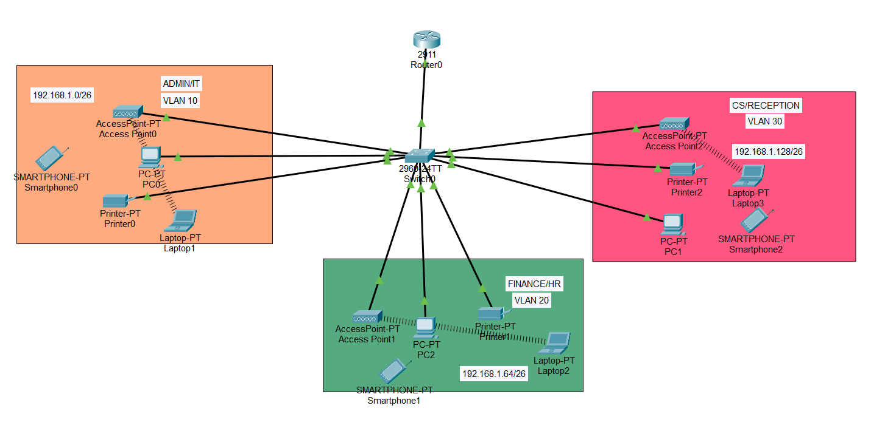

# SOHO-Network-Project

This is a Small Office/Home Office (SOHO) network design created using Cisco Packet Tracer. It demonstrates proper VLAN segmentation, inter-VLAN routing, DHCP, and wireless setup.

## 🔧 Tools Used
- Cisco Packet Tracer
- Cisco 2960 Switch
- Cisco 2911 Router
- PCs, Laptops, Smartphones, Printers, and Access Points

## 🌐 Network Layout

| Department     | VLAN | Subnet             |
|----------------|------|--------------------|
| Admin/IT       | 10   | 192.168.1.0/26     |
| Finance/HR     | 20   | 192.168.1.64/26    |
| CS/Reception   | 30   | 192.168.1.128/26   |

Each VLAN contains both wired and wireless devices. DHCP and routing are configured via the router using subinterfaces.

## 📷 Network Diagram

## 🖥️ Files
- `SOHO network.pkt`: Packet Tracer network
- `configuration_notes.txt`: CLI commands used
- `network_diagram.png`: Network screenshot

## 👤 Author
- Sahitha | [LinkedIn](https://www.linkedin.com/in/sahithamedasani/)
